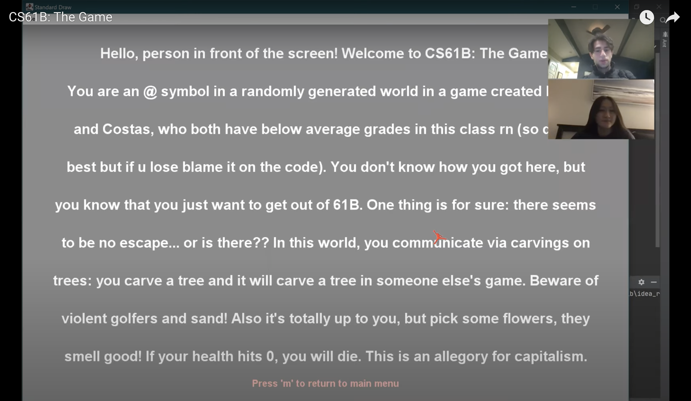

# Build Your Own World Game
CJ Hines and Costas Panay

Youtube Walkthrough: https://www.youtube.com/watch?v=MnuQPrAueWg&t=3s

## Description
Designed and implemented a 2D tile-based world exploration engine. The worlds consist of a 2D grid of tiles. The user will be able to explore the world by walking around and interacting with objects in the world from an overhead perspective. 

## Extra Credit Points
- Add some lore which is accessible from menu describing the background for your game and the story in your game
- Add flavor text for each tile which is also displayed next to the tile’s name when a mouse hovers over it. Flavor text is just a brief description which adds more of an explanation to each tile or makes a funny joke/reference
- Add some neat easter eggs or cheat codes to your game which do something fun. 
- Modify your game so that the world map consists of more than 1 screen. This is commonly done by either having stairs which lead to a different floor and a different layout
- Add portals to your world which teleport the avatar.
- Add animations.
- Items which provide points or alter the abilities of the avatar when collected.
- Add a health mechanic to your game to make it more interactive.
